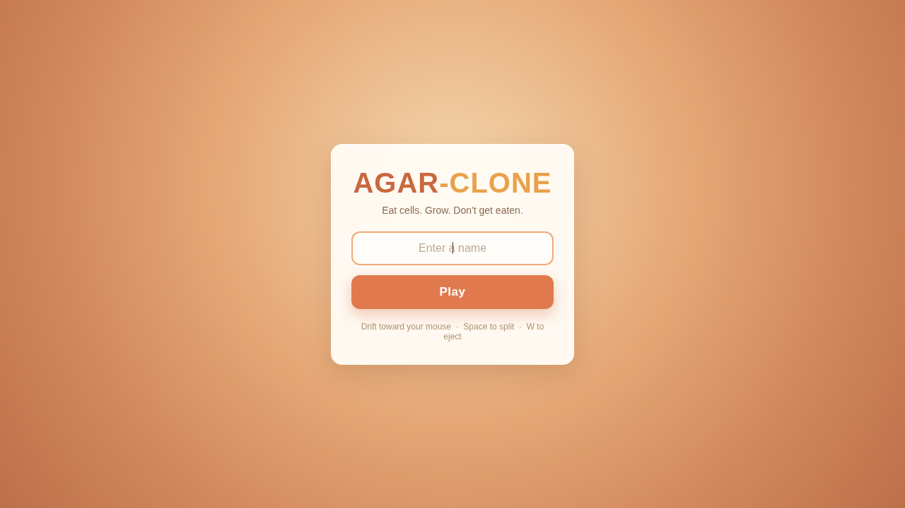
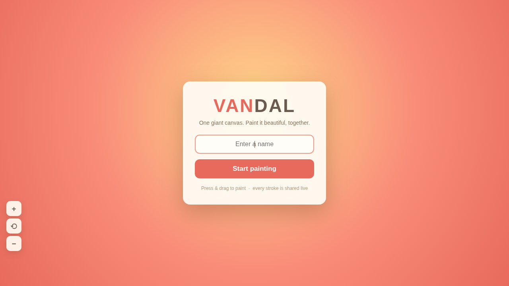

# bytes-over-the-wire

**Real-time multiplayer browser games with raw binary WebSocket protocols, implemented in four languages.**

*Juegos multijugador en tiempo real en el navegador con protocolos binarios WebSocket, implementados en cuatro lenguajes.*

> **Read the blog post / Lee el post:**
> [Bytes Over the Wire: How agar.io Stays Fast](https://misael.org/bytes-over-the-wire-io-games/) — a deep dive into binary WebSocket protocols, why fourteen bytes beat forty characters of JSON, and why the packet you receive is your neighbourhood rather than the map.
>
> *[El protocolo que agar.io nunca publicó](https://misael.org/es/bytes-over-the-wire-io-games/) — un análisis profundo de protocolos binarios WebSocket, por qué catorce bytes le ganan a cuarenta caracteres de JSON, y por qué el paquete que recibes es tu vecindario y no el mapa.*

---

<p align="center">
  
  
</p>

## What is this? / ¿Qué es esto?

This is the companion code to [Bytes Over the Wire](https://misael.org/bytes-over-the-wire-io-games/) on [misael.org](https://misael.org). Two browser-based multiplayer games — **agar-clone** and **vandal** — each with a server written **four times** (Node.js, Python, Go, Rust), all speaking the **exact same binary WebSocket protocol** to the **same JavaScript `<canvas>` client**. No game engine, no `socket.io`, no build step. Pick a game, pick a language, run it.

*Este es el código complementario del post [Bytes Over the Wire](https://misael.org/es/bytes-over-the-wire-io-games/) en [misael.org](https://misael.org). Dos juegos multijugador de navegador — **agar-clone** y **vandal** — cada uno con un servidor escrito **cuatro veces** (Node.js, Python, Go, Rust), todos hablando el **mismo protocolo binario WebSocket** al **mismo cliente JavaScript `<canvas>`**. Sin motor de juegos, sin `socket.io`, sin build. Elegi un juego, elegi un lenguaje, y ejecutalo.*

---

## Games / Juegos

| Game / Juego | Description / Descripción | Controls / Controles | Port / Puerto |
|---|---|---|:---:|
| **agar-clone** | Classic **agar.io** clone — eat cells, grow, split, eject mass, dodge viruses. 15 AI bots keep the arena alive. | Mouse + Space + W | `4100` |
| | *Clon clásico de **agar.io** — comé células, crecé, dividite, eyectá masa, esquivá virus. 15 bots AI mantienen la arena activa.* | | |
| **vandal** | **Co-op graffiti wall** — many painters spray-paint a shared 4000×2500 canvas together. Brush, spray can, shapes, undo. Sophisticated bot artists paint layered street art with human-like motion. | Click + Drag | `4504` |
| | *Muro de grafiti cooperativo — muchos pintores pintan juntos un lienzo compartido de 4000×2500. Pincel, aerosol, formas, deshacer. Bots artistas sofisticados pintan arte callejero con movimiento humano.* | | |

---

## Architecture / Arquitectura

```
┌──────────────┐     binary WebSocket      ┌──────────────────┐
│  JS <canvas> │ ◄══════════════════════► │  Server (any of  │
│    Client     │    little-endian frames   │  Node/Py/Go/Rust)│
│  (browser)   │    1-byte packet IDs      │  authoritative   │
└──────────────┘                           │  fixed-tick loop  │
                                           └──────────────────┘
```

### Key design principles / Principios de diseño clave

- **Authoritative server** — Fixed-tick simulation loop (25 Hz agar, 20 Hz vandal). Server owns all state; clients send only input.
  *Servidor autoritativo — Loop de simulación de tick fijo (25 Hz agar, 20 Hz vandal). El servidor es dueño de todo el estado; los clientes solo envían input.*

- **Binary protocol** — Compact little-endian packets with 1-byte packet IDs. No JSON. All four language implementations produce byte-identical wire output.
  *Protocolo binario — Paquetes compactos little-endian con IDs de 1 byte. Sin JSON. Las cuatro implementaciones producen output idéntico byte a byte.*

- **Client prediction + interpolation** — Own cells are predicted locally for instant feel; remote entities are interpolated between snapshots.
  *Predicción del cliente + interpolación — Las células propias se predicen localmente; las entidades remotas se interpolan entre snapshots.*

- **Area of Interest (AoI)** — Servers stream only viewport-relevant entities via spatial hash.
  *Área de interés (AoI) — Los servidores envían solo entidades relevantes al viewport via hash espacial.*

- **No dependencies beyond WebSocket** — Raw `ws` (Node), `aiohttp` (Python), `gorilla/websocket` (Go), `tokio-tungstenite` (Rust).
  *Sin dependencias más allá de WebSocket.*

---

## Project structure / Estructura del proyecto

```
bytes-over-the-wire/
├── README.md                      # this file / este archivo
├── screenshots/                   # game screenshots / capturas
│
├── agar-clone/                    # Game 1: classic agar.io
│   ├── SPEC.md                    # complete game mechanics specification
│   ├── client/                    # shared JS canvas client (no build step)
│   │   ├── index.html
│   │   ├── css/style.css
│   │   └── js/
│   │       ├── constants.js       # mirrors server constants exactly
│   │       ├── protocol.js        # binary codec (mirrors server)
│   │       ├── main.js            # bootstrap, menu, game loop
│   │       ├── net.js             # WebSocket, join sequence
│   │       ├── input.js           # mouse/keyboard input
│   │       ├── render.js          # camera, zoom, cell rendering
│   │       ├── scene.js           # visual elements (grid, border, petri dish)
│   │       └── interpolate.js     # snapshot interpolation + own-cell prediction
│   ├── server/                    # Node.js reference implementation
│   ├── server-python/             # Python port (asyncio + aiohttp)
│   ├── server-go/                 # Go port (goroutines + channels)
│   └── server-rust/               # Rust port (tokio async)
│
└── vandal/                        # Game 2: cooperative graffiti wall
    ├── README.md
    ├── client/                    # shared JS canvas client
    │   ├── index.html
    │   ├── css/style.css
    │   ├── img/                   # wall texture options
    │   └── js/
    │       ├── constants.js       # mirrors server constants
    │       ├── protocol.js        # binary codec (stroke blocks, cursors)
    │       ├── main.js            # bootstrap, menu, rAF loop
    │       ├── net.js             # WebSocket, join sequence
    │       ├── input.js           # press-drag painting, toolbar
    │       ├── render.js          # canvas rendering, camera
    │       ├── mural.js           # stroke rasterization (offscreen canvas)
    │       ├── scene.js           # wall background rendering
    │       ├── state.js           # camera, gallery fly-through
    │       ├── cursors.js         # live cursor display
    │       └── bg.js              # wall picker, Street View
    ├── server/                    # Node.js reference implementation
    ├── server-python/             # Python port
    ├── server-go/                 # Go port
    ├── server-rust/               # Rust port
    └── reference/                 # graffiti reference images
```

---

## Quick start / Inicio rápido

Pick a game and a language. Each server serves the `client/` folder on its port.
*Elige un juego y un lenguaje. Cada servidor sirve la carpeta `client/` en su puerto.*

```bash
# ── Node.js (requires Node 18+) ──────────────────────────────
cd agar-clone/server        # or vandal/server
npm install                 # dependency: ws
node index.js
# → http://localhost:4100   (agar-clone)
# → http://localhost:4504   (vandal)

# ── Python (requires Python 3.12+) ───────────────────────────
cd agar-clone/server-python
python3 -m venv .venv && .venv/bin/pip install -r requirements.txt
.venv/bin/python main.py

# ── Go ────────────────────────────────────────────────────────
cd agar-clone/server-go
go mod tidy && go run .

# ── Rust ──────────────────────────────────────────────────────
cd agar-clone/server-rust
cargo run --release         # first build compiles deps
```

Override the port with the `PORT` environment variable:
```bash
PORT=8080 node index.js
```

---

## Wire protocol / Protocolo de red

Both games use hand-rolled binary frames over WebSocket. All multibyte values are **little-endian**. Every frame starts with a **1-byte packet ID**.

*Ambos juegos usan frames binarios hechos a mano sobre WebSocket. Todos los valores multibyte son **little-endian**. Cada frame empieza con un **ID de paquete de 1 byte**.*

### agar-clone protocol (v1)

**Join sequence / Secuencia de conexión:**
```
Client → HANDSHAKE(u32 version)
Server ← VERSION_OUTDATED  (close on mismatch)
Client → SET_NICK(str name)
Server ← WELCOME(u32 yourId, u16 worldW, u16 worldH, u32 serverTick)
Server ← SNAPSHOT (every tick, 25 Hz)
```

**Server → Client (S2C):**
| ID | Name | Payload |
|:--:|------|---------|
| 0 | WELCOME | `u32 id`, `u16 w`, `u16 h`, `u32 tick` |
| 1 | SNAPSHOT | eat events, cells, food, viruses, ejects, removals |
| 2 | LEADERBOARD | `u8 count`, entries with rank/name/mass |
| 3 | PONG | `u32 clientMs`, `u32 serverTick` |
| 4 | DEATH | `u32 killerId`, `u32 finalMass` |
| 255 | VERSION_OUTDATED | (empty) |

**Client → Server (C2S):**
| ID | Name | Payload |
|:--:|------|---------|
| 0 | SET_NICK | `str name` |
| 1 | PING | `u32 clientMs` |
| 2 | INPUT_TARGET | `u16 x`, `u16 y` |
| 3 | SPLIT | (empty) |
| 4 | EJECT | (empty) |
| 5 | RESPAWN | (empty) |
| 255 | HANDSHAKE | `u32 version` |

### vandal protocol (v3)

**Server → Client (S2C):**
| ID | Name | Payload |
|:--:|------|---------|
| 0 | WELCOME | `u32 id`, `u16 canvasW`, `u16 canvasH`, `u32 tick` |
| 1 | HISTORY | `u16 count`, stroke blocks |
| 2 | STROKE | single stroke block (committed) |
| 3 | UNDO | `u32 strokeId` |
| 4 | PRESENCE | `u16 painterCount` |
| 5 | GALLERY | `u16 cx`, `u16 cy`, `u16 half`, `u16 durMs` |
| 6 | PONG | `u32 clientMs`, `u32 serverTick` |
| 7 | CURSORS | `u16 count`, cursor entries |
| 8 | STROKE_BEGIN | `u32 id`, `u32 ownerId`, meta, first point |
| 9 | STROKE_APPEND | `u32 id`, `u16 n`, points |

**Client → Server (C2S):**
| ID | Name | Payload |
|:--:|------|---------|
| 0 | SET_NICK | `str name` |
| 1 | PING | `u32 clientMs` |
| 2 | STROKE | stroke block (one-shot shapes) |
| 3 | UNDO | (empty) |
| 4 | STROKE_BEGIN | `u8 tool`, `u8 color`, `u8 size`, `u8 flags`, `u16 x`, `u16 y` |
| 5 | STROKE_APPEND | `u16 n`, points |
| 6 | STROKE_END | (empty) |
| 7 | CURSOR | `u16 x`, `u16 y`, `u8 flags`, `u8 color`, `u8 tool` |
| 255 | HANDSHAKE | `u32 version` |

---

## Game mechanics / Mecánicas de juego

### agar-clone

| Mechanic / Mecánica | Detail / Detalle |
|---|---|
| **World** | 14142 × 14142 arena, hard-clamped borders |
| **Mass → Radius** | `radius = sqrt(100 * mass)` |
| **Speed** | `1100 * mass^(-0.44)` — bigger = slower |
| **Eating** | A eats B if `A.mass >= 1.25 * B.mass` and overlap condition met |
| **Split** (Space) | Cells >= 35 mass split; max 16 cells per player |
| **Eject** (W) | Cells >= 35 mass eject a 13-mass pellet |
| **Viruses** | Mass 100, pop big cells (>= 125 mass) into pieces |
| **Decay** | 0.2%/s on cells above 100 mass |
| **Bots** | 15 simple AI (flee, chase, graze, roam) |

### vandal

| Mechanic / Mecánica | Detail / Detalle |
|---|---|
| **Canvas** | 4000 × 2500 px shared wall |
| **Tools** | Brush (B), Line (L), Roller/Fill (R), Circle (C), Eraser (E), Spray Can (S) |
| **Sizes** | Fine (6 px), Medium (15 px), Broad (32 px) |
| **Palette** | 14 curated warm pastels (no violet/magenta) |
| **Stroke streaming** | BEGIN → APPEND* → END → STROKE commit |
| **History** | Max 4000 strokes; oldest retire |
| **Undo** | Ctrl+Z removes your most recent stroke |
| **Bots** | Sophisticated painter bots with personas (piecer, tagger, bomber, doodler) |
| **Gallery** | Periodic coordinated camera fly-through of busy mural regions |
| **Bot motion** | WindMouse algorithm for human-like cursor movement |

---

## Key formulas (shared between server & client) / Fórmulas clave

```javascript
// agar-clone physics (identical on server and client)
// Física de agar-clone (idéntica en servidor y cliente)

radiusOfMass(mass)  = Math.sqrt(100 * mass)       // mass → radius
massOfRadius(r)     = (r * r) / 100                // radius → mass
speedOfMass(mass)   = 1100 * Math.pow(mass, -0.44) // mass → max speed
viewScaleOfR(R)     = Math.pow(Math.min(64/R, 1), 0.4) // camera zoom
recombineS(mass)    = 30 + 0.02 * mass             // merge cooldown (seconds)
```

---

## Environment variables / Variables de entorno

| Variable | Game | Default | Description / Descripción |
|---|---|---|---|
| `PORT` | both | `4100` / `4504` | Server listen port / Puerto del servidor |
| `WALL_W` | vandal | `4000` | Canvas width override (must fit u16) |
| `WALL_H` | vandal | `2500` | Canvas height override (must fit u16) |
| `GOOGLE_MAPS_API_KEY` | vandal | — | Enable Street View wall backgrounds (optional) |

---

## Tests performed / Pruebas realizadas

- Both Node.js servers start cleanly and serve the client
  *Ambos servidores Node.js arrancan correctamente y sirven el cliente*
- WebSocket join sequence verified: HANDSHAKE → SET_NICK → WELCOME → data flow
  *Secuencia de conexión WebSocket verificada*
- agar-clone: SNAPSHOT at 25 Hz, LEADERBOARD every second, 15 bots active
  *agar-clone: SNAPSHOT a 25 Hz, LEADERBOARD cada segundo, 15 bots activos*
- vandal: HISTORY delivery (26KB), live stroke streaming from bots, CURSORS at 20 Hz, PRESENCE
  *vandal: Entrega de HISTORY (26KB), streaming de trazos de bots en vivo, CURSORS a 20 Hz, PRESENCE*
- Protocol version handshake verified for both games
  *Handshake de versión de protocolo verificado para ambos juegos*

---

## Bug fixes applied / Correcciones aplicadas

1. **`wobblyRectPath` missing function** (vandal client `mural.js`) — The ROLLER/FILL tool would crash with a `ReferenceError`. Implemented the missing function that generates a wobbly hand-rolled rectangle outline.
   *Función faltante que causaba crash del ROLLER. Implementada.*

2. **Protocol version mismatch** (vandal polyglot servers) — Python, Go, and Rust servers had `PROTOCOL_VERSION = 2` while the Node reference uses `3`. Clients couldn't connect. Updated all to `3`.
   *Versión de protocolo incorrecta en servidores Python/Go/Rust. Actualizado a 3.*

3. **Missing `tool` byte in cursor packets** (vandal polyglot servers) — All three polyglot servers omitted the `tool` byte in both S2C cursor encoding and C2S cursor decoding, causing garbled cursor display. Fixed in Python, Go, and Rust.
   *Byte `tool` faltante en paquetes de cursor. Corregido en Python, Go y Rust.*

4. **Hardcoded absolute path** (`vandal/server/content.js`) — Reference image path was hardcoded to a specific machine. Changed to relative path using `path.resolve`.
   *Ruta absoluta hardcodeada cambiada a ruta relativa.*

---

## License / Licencia

The code is [MIT licensed](LICENSE). Reference graffiti images in `vandal/reference/` are not mine: each carries its own CC license, credited per file.

*El código está bajo [licencia MIT](LICENSE). Las imágenes de referencia en `vandal/reference/` no son mías: cada una tiene su propia licencia CC, acreditada por archivo.*
